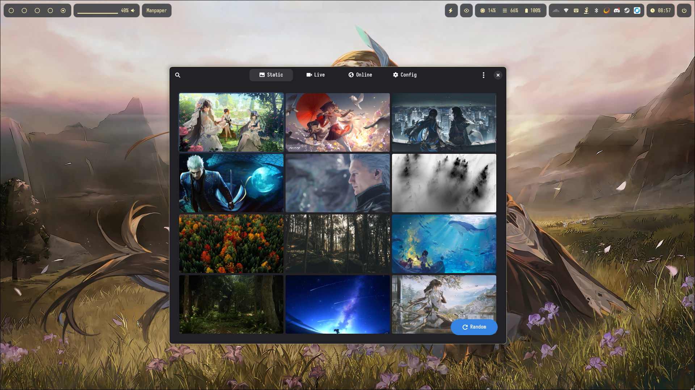

  

# Manpaper

Manpaper is a GTK4 wallpaper manager for wlroots-based compositors (preferably [Hyprland :)](https://github.com/hyprwm/Hyprland)) written in Python. It provides a clean interface to browse local wallpapers, search and download online wallpapers and apply them using various backend tools. Support for both Live Wallpapers and Static Wallpapers

## Disclaimer

> This project codebase is mostly written by AI (Google Gemini), The contributions I have made here is the app icon, some UI elements and fixing some bugs that the AI Agent can't resolve itself. If you don't trust AI-generated codes, read the source code first, or skip this repository

## Features

*   **Wallpaper Management:** Manages both static and live wallpapers.
*   **Online Wallpaper Search:** Integrates with Wallhaven.cc to search, preview, and download online wallpapers.
*   **Wallpaper Setting:** Sets wallpapers using various backends (swaybg, swww, hyprpaper for static; swww, mpvpaper for live).
*   **User Interface:** Built with GTK4 and Adwaita, providing a modern looking UI.
*   **Zen Mode:** Hides UI elements for an immersive wallpaper browsing experience.
*   **Keyboard Shortcuts:** Supports keyboard shortcuts for navigation and actions.
*   **Custom CSS**: for nerds out there

## How it looks

**Static Wallpapers view**

**Live Wallpapers view**

**Online Wallpapers view**

**Config view**

**Config view (with Custom CSS file applied)**

## Technologies

*   Python-GObject
*   GTK4, libadwaita

## Dependencies

* **swaybg**: Static Wallpaper backend (Optional)
* **swww**: Static/Live Wallpaper backend
* **mpvpaper**: Static/Live Wallpaper backend
* **ffmpegthumbnailer**: Creating preview thumbnails
* **ffmpeg**: Recode wallpapers to match display resolution
* **yt-dlp**: Set youtube videos as wallpaper

## Installation

_No installation guide yet_

## Contributing

_Your contribution are welcome_

